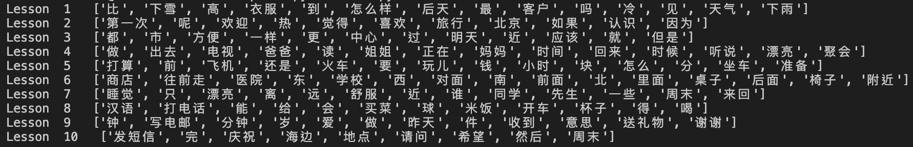
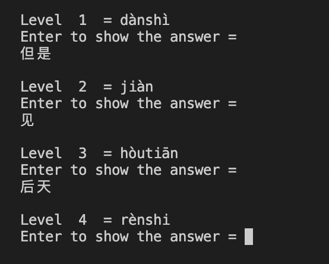

# CHINESE Dictation helper tool
A program that helps you to practice your dictation skill in your Mandarin Course. This program is created to help me practicing my dictation skill during my LANG1121 course in HKUST. Feel free to use the script and improve your chinese skill!

<b>Currently only supports HKUST LANG1121 Course</b>

### How this works?
1. Download the file doc.py together with LANG1121.docx. Then, run the code by using this command
```bash
python3 doc.py
```

2. It will show all you all the chinese characters that is inside the word document


3. It will show you the pinyin of the chinese characters, write the chinese character hanzi in your paper, then press 'ENTER' to show the correct answer and move on to the next pinyin


4. It's that simple! Have fun learning ;)